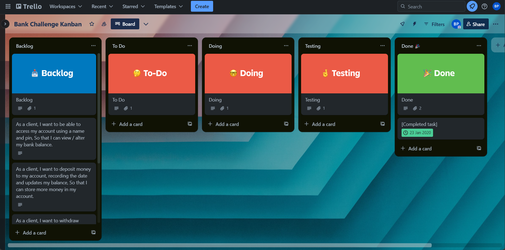
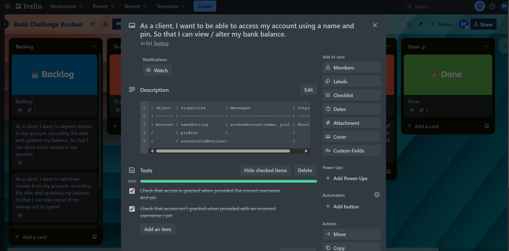
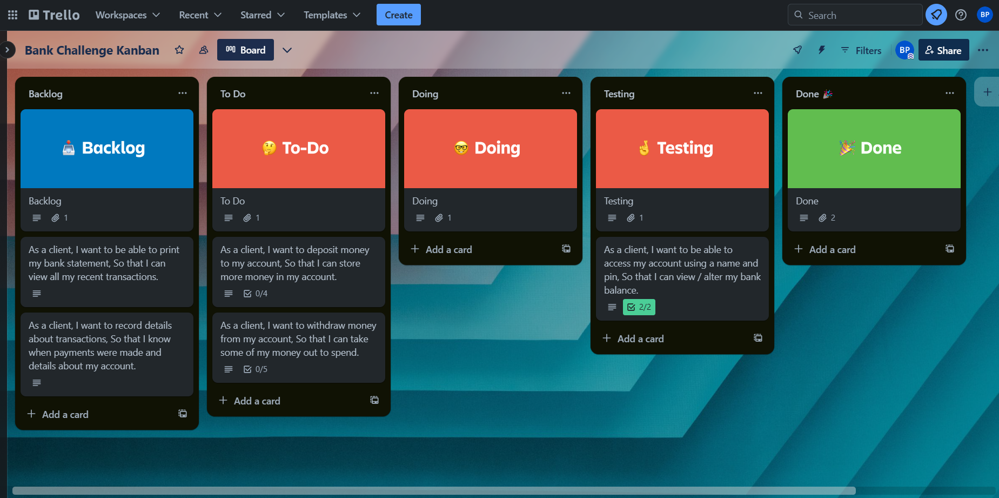
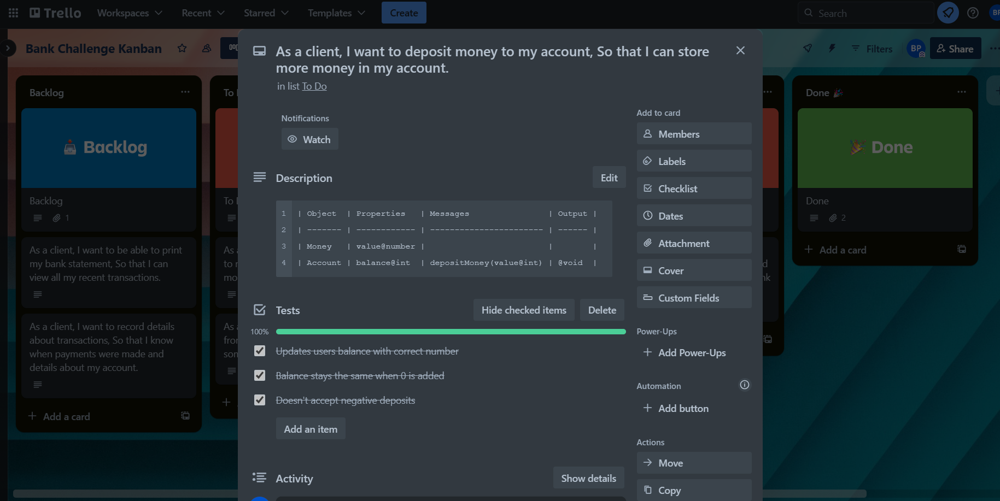
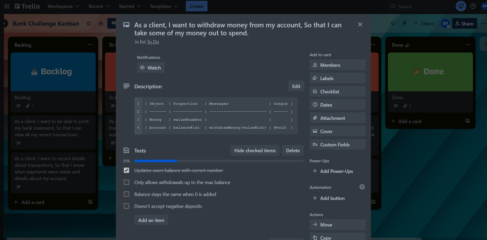
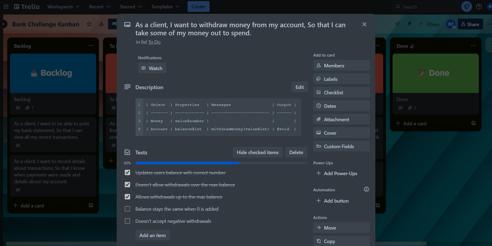
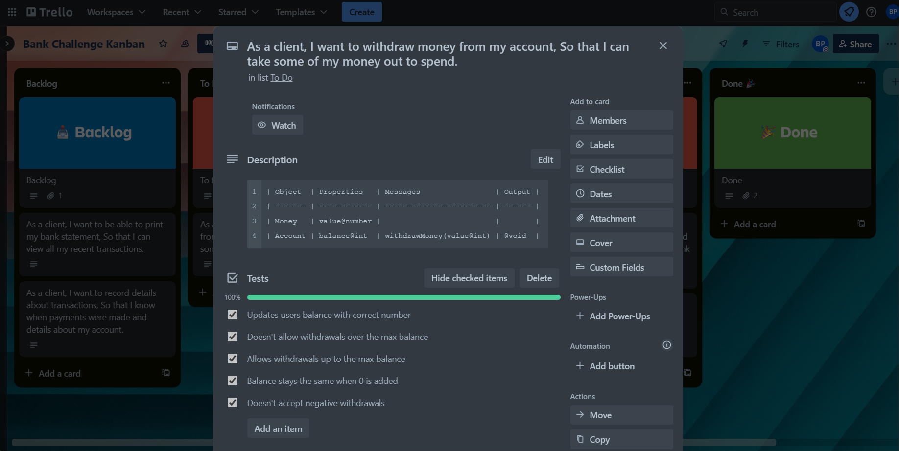

# Domain Models and Test Plan

### Task 1 - Benefits and Risks

The application benefits the client / business by not requiring a worker to collect all the previous data of the account and sort deposits / withdrawals physically. As the program does this automatically, this will increase efficiency of the business as opposed to when a worker would do this. The business would also not need to employ someone to complete the job, saving them paying the workers salary and increasing the net profit of the business.

The user benefits from using the application by having instant access to their balance and the history that they have had from previous withdrawals and deposits. This allows them easy access to their own data they may need without having to collect it themselves. Additionally, they are able to make further withdrawals / deposits to the account allowing them to take out / leave money in the account when necessary. This is key as it allows the user to freely access their accounts funds whenever they need to, and not being .

### Task 2 + 3 - User Stories + Domain Models

User Story 1

As a client,
I want to be able to access my account using a name and pin,
So that I can view / alter my bank balance.

| Object  | Properties         | Messages                 | Output   |
| ------- | ------------------ | ------------------------ | -------- |
| Account | name@string        | accessAccount(name, pin) | @boolean |
|         | pin@int            |                          |          |
|         | accessible@boolean |                          |          |

User Story 2

As a client,
I want to deposit money to my account,
So that I can store more money in my account.

| Object  | Properties   | Messages                | Output |
| ------- | ------------ | ----------------------- | ------ |
| Money   | value@number |                         |        |
| Account | balance@int  | depositMoney(value@int) | @void  |

User Story 3

As a client,
I want to withdraw money from my account,
So that I can take some of my money out to spend.

| Object  | Properties   | Messages                 | Output |
| ------- | ------------ | ------------------------ | ------ |
| Money   | value@number |                          |        |
| Account | balance@int  | withdrawMoney(value@int) | @void  |

User Story 4

As a client,
I want to record details about deposits,
So that I know when payments were made and details about my account.

| Object   | Properties             | Messages                   | Output |
| -------- | ---------------------- | -------------------------- | ------ |
| Deposits | pastTransactions@array | recordDate(date)           | @void  |
|          |                        | recordBalance(balance@int) | @void  |
|          |                        | recordValue(value@int)     | @void  |

User Story 5

As a client,
I want to record details about withdrawals,
So that I know when payments were made and details about my account.

| Object      | Properties             | Messages                   | Output |
| ----------- | ---------------------- | -------------------------- | ------ |
| Withdrawals | pastTransactions@array | recordDate(date)           | @void  |
|             |                        | recordBalance(balance@int) | @void  |
|             |                        | recordValue(value@int)     | @void  |

User Story 6

As a client,
I want to be able to print my bank statement,
So that I can view all my recent transactions.

| Object         | Properties                   | Messages                             | Output  |
| -------------- | ---------------------------- | ------------------------------------ | ------- |
| Account        | bankStatement@array          | printStatement(Bank Statement@array) | @String |
| Bank Statement | array(deposits, withdrawals) |                                      |         |
| Withdrawal     | value@number                 |                                      |         |
|                | date                         |                                      |         |
| Deposit        | value@number                 |                                      |         |
|                | date                         |                                      |         |

User Story 7

As a client,
I want to use an REPL interface,
So that I can access all the features of the application.

| Object | Properties | Messages                    | Output       |
| ------ | ---------- | --------------------------- | ------------ |
| Menu   |            | chooseFeature(input@string) | functionMenu |

### Additional Features User Stories

User Story 8

As a client,
I want to view my account statement with coloured writing,
So that it indicates when transactions affect my balance positively/negatively.

User Story 9

As a client,
I want to add an overdraft to my account,
So that I can withdraw more money if the bank account allows.

### Kanban Development

